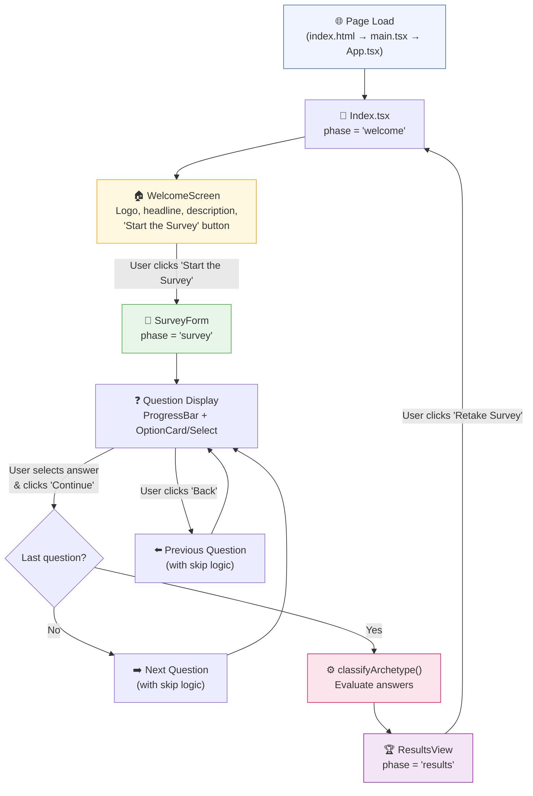
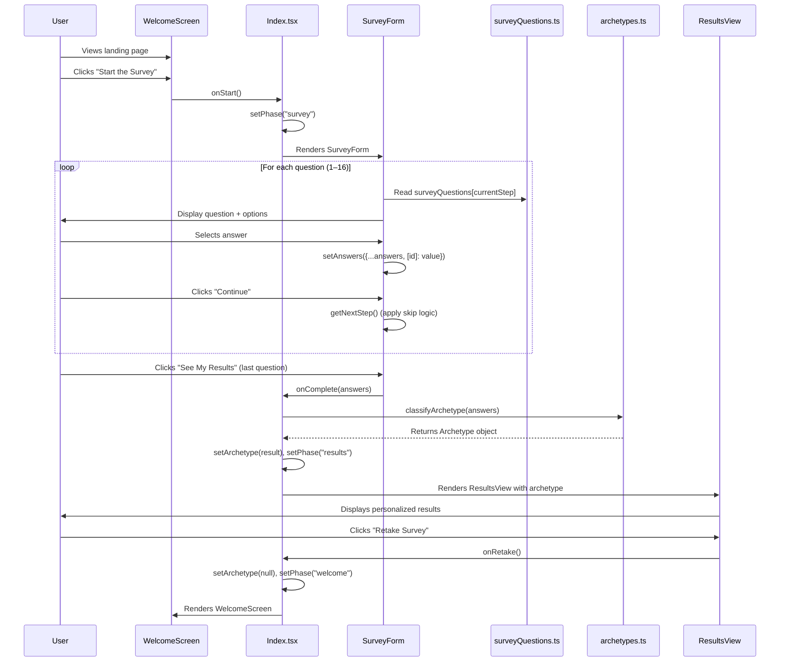
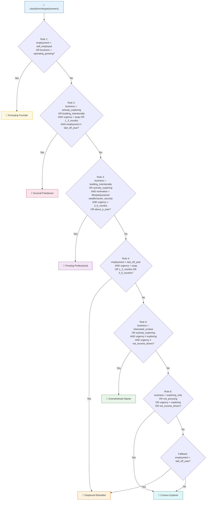
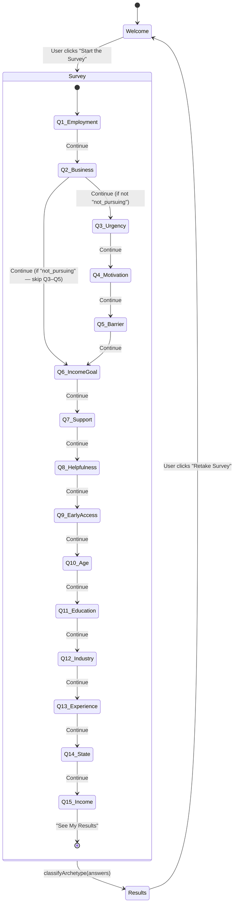

# NuFounders — Entrepreneurial Archetype Discovery Survey

## 1. Executive Summary

**NuFounders** is a career transition survey application that helps individuals discover their entrepreneurial archetype. Designed for professionals who are exploring, pivoting into, or already building a business, the app guides users through a structured questionnaire and classifies them into one of six distinct entrepreneurial profiles — such as "The Curious Explorer," "The Overwhelmed Starter," or "The Emerging Founder." Each profile comes with personalized insights, identified challenges, and a tailored NuFounders solution recommendation.

The core value proposition is clarity: rather than leaving aspiring entrepreneurs to navigate an overwhelming landscape of advice, NuFounders distills a user's employment status, business interest level, income urgency, and motivation into a single, actionable archetype. This archetype serves as the starting point for personalized guidance, early-access cohort placement, and marketplace-driven support through the NuFounders platform.

---

## 2. Tech Stack

| Technology                                                                | Version             | Purpose                            |
| ------------------------------------------------------------------------- | ------------------- | ---------------------------------- |
| [React](https://react.dev/)                                               | ^18.3.1             | UI component library               |
| [TypeScript](https://www.typescriptlang.org/)                             | ^5.8.3              | Static typing                      |
| [Vite](https://vitejs.dev/)                                               | ^5.4.19             | Build tool and dev server          |
| [TanStack React Query](https://tanstack.com/query)                        | ^5.83.0             | Async state management             |
| [Framer Motion](https://www.framer.com/motion/)                           | ^12.33.0            | Animations and transitions         |
| [React Router DOM](https://reactrouter.com/)                              | ^6.30.1             | Client-side routing                |
| [shadcn/ui](https://ui.shadcn.com/)                                       | (component library) | Pre-built accessible UI components |
| [Radix UI](https://www.radix-ui.com/)                                     | Various ^1.x–^2.x   | Headless accessible primitives     |
| [Tailwind CSS](https://tailwindcss.com/)                                  | ^3.4.17             | Utility-first CSS framework        |
| [tailwindcss-animate](https://github.com/jamiebuilds/tailwindcss-animate) | ^1.0.7              | Tailwind animation utilities       |
| [Lucide React](https://lucide.dev/)                                       | ^0.462.0            | Icon library                       |
| [React Hook Form](https://react-hook-form.com/)                           | ^7.61.1             | Form state management              |
| [Zod](https://zod.dev/)                                                   | ^3.25.76            | Schema validation                  |
| [Recharts](https://recharts.org/)                                         | ^2.15.4             | Charting library                   |
| [Sonner](https://sonner.emilkowal.ski/)                                   | ^1.7.4              | Toast notifications                |
| [class-variance-authority](https://cva.style/)                            | ^0.7.1              | Component variant management       |
| [clsx](https://github.com/lukeed/clsx)                                    | ^2.1.1              | Conditional class strings          |
| [tailwind-merge](https://github.com/dcastil/tailwind-merge)               | ^2.6.0              | Tailwind class deduplication       |
| [Vitest](https://vitest.dev/)                                             | ^3.2.4              | Unit testing framework             |
| [@testing-library/react](https://testing-library.com/react)               | ^16.0.0             | React component testing            |
| [ESLint](https://eslint.org/)                                             | ^9.32.0             | Code linting                       |

---

## 3. Project Structure

```
archetype-explorer/
├── public/
│   ├── images/
│   │   └── logo.jpeg                  # NuFounders logo displayed on welcome screen
│   ├── favicon.ico
│   ├── placeholder.svg
│   └── robots.txt
├── src/
│   ├── components/
│   │   ├── survey/
│   │   │   ├── WelcomeScreen.tsx      # Landing/hero screen with branding and "Start" CTA
│   │   │   ├── SurveyForm.tsx         # Multi-step survey engine (navigation, state, rendering)
│   │   │   ├── OptionCard.tsx         # Reusable selectable option button component
│   │   │   ├── ProgressBar.tsx        # Animated progress indicator (question X of Y)
│   │   │   └── ResultsView.tsx        # Archetype results display with personalized content
│   │   ├── ui/                        # shadcn/ui component library (~50 components)
│   │   │   ├── button.tsx
│   │   │   ├── card.tsx
│   │   │   ├── input.tsx
│   │   │   ├── select.tsx
│   │   │   ├── toast.tsx
│   │   │   └── ... (and many more)
│   │   └── NavLink.tsx                # React Router NavLink wrapper with active class support
│   ├── data/
│   │   ├── archetypes.ts             # Archetype definitions + classification algorithm
│   │   └── surveyQuestions.ts        # All survey questions, options, and type definitions
│   ├── hooks/
│   │   ├── use-mobile.tsx            # Responsive breakpoint detection hook
│   │   └── use-toast.ts             # Toast notification state management hook
│   ├── lib/
│   │   └── utils.ts                  # Utility: cn() for merging Tailwind classes
│   ├── pages/
│   │   ├── Index.tsx                 # Main page: orchestrates Welcome → Survey → Results flow
│   │   └── NotFound.tsx              # 404 catch-all page
│   ├── test/
│   │   ├── setup.ts                  # Vitest setup (jest-dom matchers, matchMedia mock)
│   │   └── example.test.ts           # Placeholder test
│   ├── App.tsx                       # Root component: providers, router, toasters
│   ├── App.css                       # Legacy/unused Vite starter CSS
│   ├── index.css                     # Global styles: Tailwind directives, CSS variables, fonts
│   ├── main.tsx                      # Application entry point
│   └── vite-env.d.ts                # Vite type declarations
├── index.html                        # HTML shell
├── package.json
├── tailwind.config.ts
├── vite.config.ts
├── vitest.config.ts
├── tsconfig.json / tsconfig.app.json / tsconfig.node.json
├── eslint.config.js
├── postcss.config.js
└── components.json                   # shadcn/ui configuration
```

---

## 4. Application Flow (Step-by-Step)

### Walkthrough

1. **Page Load** — The browser loads `index.html`, which mounts the React app via `main.tsx` → `App.tsx`. The `App` component sets up providers (QueryClient, TooltipProvider, Toasters) and the `BrowserRouter`. The `/` route renders the `Index` page.

2. **Welcome Phase** — `Index.tsx` initializes with `phase = "welcome"`. The `WelcomeScreen` component renders with:
   - The NuFounders logo (from `/images/logo.jpeg`)
   - A "Career Transition Survey" badge
   - The headline "NuFounders Career Archetype Survey"
   - A description of the survey's purpose
   - Estimated time (5–10 minutes) and confidentiality indicators
   - A **"Start the Survey"** button

3. **Survey Phase** — When the user clicks "Start the Survey," `handleStart()` sets `phase` to `"survey"`. Framer Motion's `AnimatePresence` cross-fades from the welcome screen to the `SurveyForm` component. The survey presents 16 questions one at a time (with conditional skip logic — see Section 5).

4. **Answering Questions** — For each question, the user selects an option via `OptionCard` buttons (single/multi-select), a dropdown (`Select` component for the state question), or a conditional email input. The `ProgressBar` shows "Question X of Y" with an animated fill bar.

5. **Navigation** — The user clicks **"Continue"** to advance or **"Back"** to return. Skip logic may jump from Question 2 directly to Question 6 if the user selects "Not pursuing entrepreneurship."

6. **Survey Completion** — On the final question, the "Continue" button reads **"See My Results."** Clicking it calls `handleComplete(answers)`, which passes all collected answers to `classifyArchetype()`.

7. **Classification** — The `classifyArchetype()` function in `src/data/archetypes.ts` evaluates the user's answers to questions 1–4 (employment status, business interest, income urgency, motivation) through a priority-ordered rule set and returns one of six `Archetype` objects.

8. **Results Phase** — `Index.tsx` sets `phase` to `"results"` and stores the archetype. The `ResultsView` component renders with staggered animations:
   - The archetype emoji and name (e.g., 🔭 "The Curious Explorer")
   - A personalized headline
   - Body paragraphs explaining the user's situation
   - Bullet points identifying key challenges
   - A "NuFounders Solution" card with platform-specific guidance
   - A call-to-action message
   - A **"Retake Survey"** button that resets to the welcome phase

9. **Retake** — Clicking "Retake Survey" calls `handleRetake()`, which clears the archetype, resets to `phase = "welcome"`, and scrolls to the top.

### Application Navigation Flow



### Data Flow Sequence Diagram



---


## 5. Survey Logic (Step-by-Step)

### Questions and Data Collection

The survey consists of **16 questions** defined in `src/data/surveyQuestions.ts`. Each question has an `id`, `type` (single, multi, email-conditional, or dropdown), and a set of `options`. User responses are stored in a `SurveyAnswers` object (`{ [questionId: string]: string | string[] }`).

| #   | Question ID            | Question Summary                            | Type              | Data Collected                                                                                                                         |
| --- | ---------------------- | ------------------------------------------- | ----------------- | -------------------------------------------------------------------------------------------------------------------------------------- |
| 1   | `employment_status`    | Current employment situation                | single            | One of: `employed_full_time`, `contracted`, `employed_itching`, `laid_off_year`, `self_employed`, `other`                              |
| 2   | `considering_business` | Considering starting/growing a business?    | single            | One of: `exploring_only`, `interested_unclear`, `actively_exploring`, `building_intentionally`, `operating_growing`, `not_pursuing`    |
| 3   | `income_urgency`       | How soon do you need income?                | single            | One of: `exploring`, `about_a_year`, `3_6_months`, `1_3_months`, `asap`, `not_income_driven`                                           |
| 4   | `motivation`           | Primary motivation for starting a business  | single            | One of: `immediate_financial`, `lifestyle_flexibility`, `career_security`, `limited_opportunities`, `purpose_impact`, `wealth_scaling` |
| 5   | `biggest_barrier`      | Biggest barrier holding you back            | single            | One of: `business_setup`, `finding_customers`, `choosing_idea`, `confidence_risk`, `capacity_support`, `financial_runway`              |
| 6   | `income_goal`          | Meaningful monthly income "win" in 6 months | single            | One of: `first_customers`, `500_1500`, `1500_3500`, `3500_7000`, `7000_12000`, `replace_prior`                                         |
| 7   | `support_types`        | Most valuable types of support (pick 3)     | multi (max 3)     | Array of up to 3: `step_by_step`, `coaching`, `peer_community`, `tools_templates`, `help_customers`, `funding`                         |
| 8   | `platform_helpfulness` | How helpful does NuFounders sound?          | single            | One of: `extremely_helpful`, `very_helpful`, `somewhat_helpful`, `helpful_not_now`, `probably_not`, `not_relevant`                     |
| 9   | `early_access`         | Interest in early access cohort             | email-conditional | Selection + optional email address (stored as `early_access_email`)                                                                    |
| 10  | `age_range`            | Age range (Demographics section)            | single            | One of: `under_25`, `25_34`, `35_44`, `45_54`, `55_plus`, `prefer_not`                                                                 |
| 11  | `education`            | Highest education level                     | single            | One of: `high_school`, `some_college`, `associate`, `bachelors`, `masters`, `doctorate`, `prefer_not`                                  |
| 12  | `industry`             | Most recent industry                        | single            | One of 12 industry values                                                                                                              |
| 13  | `experience_years`     | Years of professional experience            | single            | One of: `0_4`, `5_9`, `10_14`, `15_19`, `20_plus`                                                                                      |
| 14  | `state`                | Current U.S. state                          | dropdown          | U.S. state code or `outside_us`                                                                                                        |
| 15  | `prior_income`         | Household income before job change          | single            | One of: `under_75k`, `75k_100k`, `100k_150k`, `150k_200k`, `200k_250k`, `over_250k`, `prefer_not`                                      |

### Response Storage and Processing

- **State management**: `SurveyForm` uses React `useState` to maintain `answers` (a `SurveyAnswers` dictionary), `currentStep` (0-based index), `email`, `otherText`, and animation `direction`.
- **Single-select questions**: Clicking an option sets `answers[questionId] = selectedValue`.
- **Multi-select questions** (Q7): Clicking toggles the value in/out of an array, capped at `maxSelections` (3).
- **Email-conditional questions** (Q9): If the user selects a positive interest option (`yes_apply`, `yes_learn_more`, `maybe`, `maybe_later`), an email input appears. The email is stored as `answers[questionId + "_email"]`.
- **"Other" text** (Q1): If the user selects "Other" for employment status, a textarea appears. The text is stored as `answers[questionId + "_other"]`.
- **Skip logic**: If Q2 answer is `not_pursuing` (not pursuing entrepreneurship), the survey skips Q3–Q5 and jumps directly to Q6 (`income_goal`). The back button respects this skip.

### Archetype Classification Algorithm

The `classifyArchetype()` function in `src/data/archetypes.ts` uses **only four inputs** from the survey answers to determine the archetype:

1. `employment_status` (Q1)
2. `considering_business` (Q2)
3. `income_urgency` (Q3)
4. `motivation` (Q4)

The algorithm evaluates rules in **priority order** (highest priority first). The first matching rule wins:

**Rule 1 — Emerging Founder** (highest priority):
- Condition: `employment_status == "self_employed"` OR `considering_business == "operating_growing"`
- Rationale: Already running a business → founder mode

**Rule 2 — Survival Freelancer**:
- Condition: (`considering_business` is `actively_exploring` OR `building_intentionally`) AND (`income_urgency` is `asap` OR `1_3_months`) AND `employment_status != "laid_off_year"`
- Rationale: Actively building + urgent income need + not recently displaced

**Rule 3 — Pivoting Professional**:
- Condition: (`considering_business` is `building_intentionally` OR `actively_exploring`) AND (`motivation` is `lifestyle_flexibility`, `purpose_impact`, `wealth_scaling`, OR `career_security`) AND (`income_urgency` is `3_6_months` OR `about_a_year`)
- Rationale: Intentional builder + independence-oriented motivation + moderate timeline

**Rule 4 — Recently Displaced Rebuilder**:
- Condition: `employment_status == "laid_off_year"` AND (`income_urgency` is `asap`, `1_3_months`, OR `3_6_months`)
- Rationale: Recently laid off + urgent-to-moderate income need

**Rule 5 — Overwhelmed Starter**:
- Condition: (`considering_business` is `interested_unclear` OR `actively_exploring`) AND `income_urgency` is NOT `exploring` AND NOT `not_income_driven`
- Rationale: Interested but unclear + some income timeline pressure

**Rule 6 — Curious Explorer**:
- Condition: `considering_business` is `exploring_only` OR `not_pursuing` OR `income_urgency` is `exploring` OR `not_income_driven`
- Rationale: Just exploring or no income urgency

**Fallback**: If no rule matches, users who are `laid_off_year` get "Displaced Rebuilder"; all others get "Curious Explorer."

### Classification Examples

1. **Self-employed user** → Regardless of other answers, they match Rule 1 → **The Emerging Founder** 👑
   - Example: Employment = `self_employed`, Business = `building_intentionally`, Urgency = `3_6_months`, Motivation = `wealth_scaling`

2. **Actively exploring + needs income ASAP** → Matches Rule 2 → **The Survival Freelancer** ⚡
   - Example: Employment = `employed_full_time`, Business = `actively_exploring`, Urgency = `asap`, Motivation = `immediate_financial`

3. **Building intentionally + wants lifestyle flexibility + 3–6 month timeline** → Matches Rule 3 → **The Pivoting Professional** 🧭
   - Example: Employment = `contracted`, Business = `building_intentionally`, Urgency = `3_6_months`, Motivation = `lifestyle_flexibility`

4. **Laid off + needs income within 1–3 months** → Matches Rule 4 → **The Recently Displaced Rebuilder** 🔨
   - Example: Employment = `laid_off_year`, Business = `interested_unclear`, Urgency = `1_3_months`, Motivation = `immediate_financial`

5. **Interested but unclear + aiming for income in about a year** → Matches Rule 5 → **The Overwhelmed Starter** 🧩
   - Example: Employment = `employed_full_time`, Business = `interested_unclear`, Urgency = `about_a_year`, Motivation = `career_security`

6. **Just exploring, no income urgency** → Matches Rule 6 → **The Curious Explorer** 🔭
   - Example: Employment = `employed_full_time`, Business = `exploring_only`, Urgency = `exploring`, Motivation = `purpose_impact`

### Survey Decision Tree



### Survey Phase Transitions



---

## 6. Archetypes Reference

### 🔭 The Curious Explorer (`curious_explorer`)

| Property                | Details                                                                                                                                     |
| ----------------------- | ------------------------------------------------------------------------------------------------------------------------------------------- |
| **Headline**            | "You're Exploring What's Possible — And That's Exactly Where Most Founders Start."                                                          |
| **Mindset**             | Discovery mode — curious about entrepreneurship but unsure if it's the right path                                                           |
| **Key Challenges**      | Too many ideas · Not knowing what's realistic · Consuming information without clear next steps                                              |
| **NuFounders Solution** | Helps people move from learning → testing → earning without needing to "go all in" before ready                                             |
| **CTA**                 | "The fastest progress usually comes from testing small, low-risk ways to turn skills into real market demand."                              |
| **Trigger Conditions**  | `considering_business` = `exploring_only` or `not_pursuing`; OR `income_urgency` = `exploring` or `not_income_driven`; OR ultimate fallback |
| **Color Gradient**      | Blue → Cyan (`from-blue-500 to-cyan-400`)                                                                                                   |

### 🧩 The Overwhelmed Starter (`overwhelmed_starter`)

| Property                | Details                                                                                                                             |
| ----------------------- | ----------------------------------------------------------------------------------------------------------------------------------- |
| **Headline**            | "You're Ready To Start — You Just Need a Clear Path."                                                                               |
| **Mindset**             | Past curiosity — wants to build something but doesn't want to waste time, money, or energy                                          |
| **Key Challenges**      | Clear sequencing · Offer clarity · Confidence in what will actually sell                                                            |
| **NuFounders Solution** | Helps go from Idea → Offer → Customers → Revenue with marketplace exposure and guided execution                                     |
| **CTA**                 | "If you want to see how this could accelerate your first real revenue, early access may be worth exploring."                        |
| **Trigger Conditions**  | `considering_business` = `interested_unclear` or `actively_exploring`; AND `income_urgency` ≠ `exploring` and ≠ `not_income_driven` |
| **Color Gradient**      | Emerald → Teal (`from-emerald-500 to-teal-400`)                                                                                     |

### 🔨 The Recently Displaced Rebuilder (`displaced_rebuilder`)

| Property                | Details                                                                                                        |
| ----------------------- | -------------------------------------------------------------------------------------------------------------- |
| **Headline**            | "You're Rebuilding — And That Can Become Your Strongest Advantage."                                            |
| **Mindset**             | Seeking stability, control, and a path forward not dependent on employer decisions                             |
| **Key Challenges**      | Existing skills · Speed to market · Focus on real income, not theory                                           |
| **NuFounders Solution** | Shortens the path from skills → customers → income through AI matching + marketplace access                    |
| **CTA**                 | "If you're looking for faster ways to turn experience into income, early cohort access could be a strong fit." |
| **Trigger Conditions**  | `employment_status` = `laid_off_year` AND `income_urgency` = `asap`, `1_3_months`, or `3_6_months`             |
| **Color Gradient**      | Orange → Amber (`from-orange-500 to-amber-400`)                                                                |

### 🧭 The Pivoting Professional (`pivoting_professional`)

| Property                | Details                                                                                                                                                                                                                                |
| ----------------------- | -------------------------------------------------------------------------------------------------------------------------------------------------------------------------------------------------------------------------------------- |
| **Headline**            | "You're Positioned To Build Something Real — Not Just Experiment."                                                                                                                                                                     |
| **Mindset**             | Approaching entrepreneurship intentionally — looking for a model that works, not hype                                                                                                                                                  |
| **Key Strengths**       | Marketable expertise · Professional credibility · Real-world problem knowledge                                                                                                                                                         |
| **NuFounders Solution** | Turns professional skill into scalable revenue opportunities — not just side projects                                                                                                                                                  |
| **CTA**                 | "If you're serious about building this correctly and efficiently, early access may be worth reviewing."                                                                                                                                |
| **Trigger Conditions**  | `considering_business` = `building_intentionally` or `actively_exploring`; AND `motivation` = `lifestyle_flexibility`, `purpose_impact`, `wealth_scaling`, or `career_security`; AND `income_urgency` = `3_6_months` or `about_a_year` |
| **Color Gradient**      | Violet → Purple (`from-violet-500 to-purple-400`)                                                                                                                                                                                      |

### ⚡ The Survival Freelancer (`survival_freelancer`)

| Property                | Details                                                                                                                                                             |
| ----------------------- | ------------------------------------------------------------------------------------------------------------------------------------------------------------------- |
| **Headline**            | "You're Already Doing This — Now It's About Consistency and Scale."                                                                                                 |
| **Mindset**             | Has proven someone will pay — now needs predictability and systems                                                                                                  |
| **Key Challenges**      | Predictable customer flow · Pricing confidence · Systems that remove chaos                                                                                          |
| **NuFounders Solution** | Helps freelancers transition into real business owners with customer pipeline support, offer packaging, and marketplace distribution                                |
| **CTA**                 | "If you want to turn inconsistent income into reliable revenue, you may want to explore early cohort access."                                                       |
| **Trigger Conditions**  | `considering_business` = `actively_exploring` or `building_intentionally`; AND `income_urgency` = `asap` or `1_3_months`; AND `employment_status` ≠ `laid_off_year` |
| **Color Gradient**      | Rose → Pink (`from-rose-500 to-pink-400`)                                                                                                                           |

### 👑 The Emerging Founder (`emerging_founder`)

| Property                | Details                                                                                                       |
| ----------------------- | ------------------------------------------------------------------------------------------------------------- |
| **Headline**            | "You're In Founder Mode — Now It's About Leverage."                                                           |
| **Mindset**             | Already thinks like a business owner — focus is shifting toward scaling                                       |
| **Key Focus Areas**     | Scaling revenue · Reducing founder bottlenecks · Increasing leverage through systems and distribution         |
| **NuFounders Solution** | Combines AI-driven opportunity matching with marketplace exposure and founder-level growth tooling            |
| **CTA**                 | "If you're looking for leverage — not just learning — early access may be a strong fit."                      |
| **Trigger Conditions**  | `employment_status` = `self_employed` OR `considering_business` = `operating_growing` (highest priority rule) |
| **Color Gradient**      | Amber → Yellow (`from-amber-500 to-yellow-400`)                                                               |

---

## 7. Getting Started

### Prerequisites

- **Node.js** (v18+ recommended) — [install with nvm](https://github.com/nvm-sh/nvm#installing-and-updating)
- **npm** (comes with Node.js)

### Installation

```sh
# Clone the repository
git clone <YOUR_GIT_URL>

# Navigate to the project directory
cd archetype-explorer

# Install dependencies
npm install
```

### Development

```sh
# Start the dev server (runs on http://localhost:8080)
npm run dev
```

### Build

```sh
# Production build
npm run build

# Development build (with source maps)
npm run build:dev

# Preview the production build locally
npm run preview
```

### Testing

```sh
# Run tests once
npm test

# Run tests in watch mode
npm run test:watch
```

### Linting

```sh
npm run lint
```

### Environment Configuration

No environment variables are required for local development. The Vite dev server runs on port **8080** with HMR overlay disabled (configured in `vite.config.ts`). The `@` path alias resolves to `./src/` for clean imports.