# NuFounders — Entrepreneurial Archetype Discovery Survey

## 1. Executive Summary

**NuFounders** is a career transition survey application that helps individuals discover their entrepreneurial archetype. Designed for professionals who are exploring, pivoting into, or already building a business, the app guides users through a structured questionnaire and classifies them into one of six distinct entrepreneurial profiles — such as "The Curious Explorer," "The Overwhelmed Starter," or "The Emerging Founder." Each profile comes with personalized insights, identified challenges, and a tailored NuFounders solution recommendation.

The core value proposition is clarity: rather than leaving aspiring entrepreneurs to navigate an overwhelming landscape of advice, NuFounders distills a user's employment status, business interest level, income urgency, and motivation into a single, actionable archetype. This archetype serves as the starting point for personalized guidance, early-access cohort placement, and marketplace-driven support through the NuFounders platform.

---

## 2. Tech Stack

| Technology                                                                | Version             | Purpose                            |
| ------------------------------------------------------------------------- | ------------------- | ---------------------------------- |
| [React](https://react.dev/)                                               | ^18.3.1             | UI component library               |
| [TypeScript](https://www.typescriptlang.org/)                             | ^5.8.3              | Static typing                      |
| [Vite](https://vitejs.dev/)                                               | ^5.4.19             | Build tool and dev server          |
| [TanStack React Query](https://tanstack.com/query)                        | ^5.83.0             | Async state management             |
| [Framer Motion](https://www.framer.com/motion/)                           | ^12.33.0            | Animations and transitions         |
| [React Router DOM](https://reactrouter.com/)                              | ^6.30.1             | Client-side routing                |
| [shadcn/ui](https://ui.shadcn.com/)                                       | (component library) | Pre-built accessible UI components |
| [Radix UI](https://www.radix-ui.com/)                                     | Various ^1.x–^2.x   | Headless accessible primitives     |
| [Tailwind CSS](https://tailwindcss.com/)                                  | ^3.4.17             | Utility-first CSS framework        |
| [tailwindcss-animate](https://github.com/jamiebuilds/tailwindcss-animate) | ^1.0.7              | Tailwind animation utilities       |
| [Lucide React](https://lucide.dev/)                                       | ^0.462.0            | Icon library                       |
| [React Hook Form](https://react-hook-form.com/)                           | ^7.61.1             | Form state management              |
| [Zod](https://zod.dev/)                                                   | ^3.25.76            | Schema validation                  |
| [Recharts](https://recharts.org/)                                         | ^2.15.4             | Charting library                   |
| [Sonner](https://sonner.emilkowal.ski/)                                   | ^1.7.4              | Toast notifications                |
| [class-variance-authority](https://cva.style/)                            | ^0.7.1              | Component variant management       |
| [clsx](https://github.com/lukeed/clsx)                                    | ^2.1.1              | Conditional class strings          |
| [tailwind-merge](https://github.com/dcastil/tailwind-merge)               | ^2.6.0              | Tailwind class deduplication       |
| [Vitest](https://vitest.dev/)                                             | ^3.2.4              | Unit testing framework             |
| [@testing-library/react](https://testing-library.com/react)               | ^16.0.0             | React component testing            |
| [ESLint](https://eslint.org/)                                             | ^9.32.0             | Code linting                       |

---

## 3. Project Structure

```
archetype-explorer/
├── api/                               # Vercel serverless functions
│   ├── analytics.ts                   # Survey funnel event ingestion endpoint
│   ├── complete.ts                    # Survey completion handler (promo code + webhook)
│   ├── generate-results.ts            # AI summary + certificate generation
│   ├── migrate.ts                     # Database migration utility
│   ├── session.ts                     # Session CRUD (create, retrieve, update)
│   └── lib/
│       ├── ai.ts                      # OpenAI integration for personalized summaries
│       ├── certificate.ts             # Cloudinary certificate image generation
│       ├── db.ts                      # Neon PostgreSQL connection helper
│       └── promo.ts                   # Promo code generation utility
├── public/
│   ├── images/
│   │   └── logo.jpeg                  # NuFounders logo displayed on welcome screen
│   ├── favicon.ico
│   ├── placeholder.svg
│   └── robots.txt
├── src/
│   ├── components/
│   │   ├── survey/
│   │   │   ├── AISummaryCard.tsx       # Displays AI-generated executive summary
│   │   │   ├── CertificateCard.tsx     # Displays and downloads branded certificate
│   │   │   ├── Confetti.tsx            # Canvas-based confetti celebration animation
│   │   │   ├── OptionCard.tsx          # Reusable selectable option button component
│   │   │   ├── ProgressBar.tsx         # Animated progress indicator (question X of Y)
│   │   │   ├── PromoCodeDisplay.tsx    # Promo code display with clipboard copy
│   │   │   ├── ResultsView.tsx         # Archetype results + retake comparison banner
│   │   │   ├── SurveyForm.tsx          # Multi-step survey engine with analytics tracking
│   │   │   ├── UserInfoScreen.tsx      # Pre-survey name/email capture screen
│   │   │   └── WelcomeScreen.tsx       # Landing/hero screen with branding and "Start" CTA
│   │   ├── ui/                         # shadcn/ui component library (~50 components)
│   │   └── NavLink.tsx                 # React Router NavLink wrapper (unused)
│   ├── data/
│   │   ├── archetypes.ts              # Archetype definitions + classification algorithm
│   │   └── surveyQuestions.ts         # All survey questions, options, and type definitions
│   ├── hooks/
│   │   ├── useSession.ts              # Session management with retake tracking
│   │   ├── use-mobile.tsx             # Responsive breakpoint detection hook
│   │   └── use-toast.ts              # Toast notification state management hook
│   ├── lib/
│   │   ├── analytics.ts              # Client-side funnel event tracker with batching
│   │   └── utils.ts                   # Utility: cn() for merging Tailwind classes
│   ├── pages/
│   │   ├── Index.tsx                  # Main page: orchestrates Welcome → Survey → Results flow
│   │   └── NotFound.tsx               # 404 catch-all page
│   ├── test/
│   │   ├── setup.ts                   # Vitest setup (jest-dom matchers, matchMedia mock)
│   │   └── example.test.ts            # Placeholder test
│   ├── App.tsx                        # Root component: providers, router, toasters
│   ├── App.css                        # Legacy/unused Vite starter CSS
│   ├── index.css                      # Global styles: Tailwind directives, CSS variables, fonts
│   ├── main.tsx                       # Application entry point
│   └── vite-env.d.ts                 # Vite type declarations
├── index.html                         # HTML shell with NuFounders branding + OG tags
├── vercel.json                        # Vercel config with API rewrites + SPA fallback
├── package.json
├── tailwind.config.ts
├── vite.config.ts
├── vitest.config.ts
├── tsconfig.json / tsconfig.app.json / tsconfig.node.json
├── eslint.config.js
├── postcss.config.js
└── components.json                    # shadcn/ui configuration
```

---

## 4. Completed Features (All 7 Integration Phases)

### Phase 1 — Survey Backend API & Session Persistence ✅

- **Vercel serverless functions** (`api/session.ts`, `api/complete.ts`) with Neon PostgreSQL
- **Session CRUD**: `GET` (retrieve), `POST` (create with `nanoid`), `PUT` (save answers/step), `PATCH` (save user info)
- **Dual persistence**: `useSession` hook maintains both `localStorage` and server-side session state
- **Resume functionality**: Survey resumes at the correct step with previous answers restored on page refresh
- **Auto-save**: Answers saved to backend on each step navigation
- **Zod email validation** on the early-access question with inline error messages

### Phase 2 — Pre-Survey Name/Email & Branding ✅

- **`UserInfoScreen.tsx`**: Name (required) + email (optional with Zod validation) capture between Welcome and Survey
- **NuFounders branding**: `index.html` title, description, OG tags, Twitter cards, and favicon all updated
- **Logo display**: NuFounders logo on welcome screen from `/images/logo.jpeg`

### Phase 3 — Promo Code & Completion UX ✅

- **`PromoCodeDisplay.tsx`**: Large code display, clipboard copy with toast confirmation, "Don't lose this code!" callout
- **`Confetti.tsx`**: Canvas-based confetti celebration on survey completion
- **Referral system**: Shareable referral link (`?ref=<sessionId>`) with copy-to-clipboard
- **Completion webhook**: Fires async webhook to NuFounders main app on survey completion

### Phase 4 — AI-Powered Results & Certificate ✅

- **`api/generate-results.ts`**: OpenAI-powered executive summary generation based on archetype + answers
- **`api/lib/certificate.ts`**: Branded certificate image via Cloudinary text overlay
- **`AISummaryCard.tsx`**: Displays personalized AI summary with loading states
- **`CertificateCard.tsx`**: Certificate preview with download button
- **Data persistence**: Certificate URL and AI summary stored in `survey_sessions` table

### Phase 5 — Points System Dashboard (NuFounders Main App) ✅

- **`PromoRedemption.tsx`**: Promo code redemption UI on Dashboard page
- **`PointsBalance.tsx`**: Animated points counter with SVG level ring
- **`TransactionHistory.tsx`**: Points transaction history display
- Wired into Dashboard page with responsive grid layout

### Phase 6 — Admin Dashboard Enhancements (NuFounders Main App) ✅

- **`SurveyAdmin.tsx`**: Paginated, filterable survey sessions table
- **Archetype distribution**: Recharts horizontal bar chart
- **Promo code metrics**: 4 KPI cards with aggregate redemption stats
- **Webhook notification feed**: Auto-refreshes every 30 seconds
- **Investor Traction Dashboard**: Moved from user Dashboard to Admin Dashboard
- **Survey Analytics**: Added to admin sidebar + quick actions grid

### Phase 7 — Analytics & Polish ✅

- **Client-side analytics** (`src/lib/analytics.ts`):
  - Event batching with 3-second debounce
  - `navigator.sendBeacon` with `fetch` fallback
  - Auto-flush on `beforeunload` and `visibilitychange`
  - Tracked events: `survey_start`, `step_viewed`, `step_answered`, `step_back`, `survey_completed`, `survey_retake`, `results_viewed`, `drop_off`
- **Backend analytics endpoint** (`api/analytics.ts`):
  - `POST /api/analytics` receives batched events
  - Auto-creates `survey_events` table with `session_id` index
  - Handles both JSON fetch and sendBeacon blob payloads
- **Retake tracking**:
  - `useSession` stores `previousArchetype` in `localStorage` on reset
  - New session reads retake flag and passes `isRetake` to completion API
  - `ResultsView` retake comparison banner shows archetype evolution
- **Session management**: `previousArchetype` and `isRetake` fields in `SessionData`

---

## 5. Application Flow (Step-by-Step)

### Walkthrough

1. **Page Load** — The browser loads `index.html`, which mounts the React app via `main.tsx` → `App.tsx`. The `App` component sets up providers (QueryClient, TooltipProvider, Toasters) and the `BrowserRouter`. The `/` route renders the `Index` page.

2. **Welcome Phase** — `Index.tsx` initializes with `phase = "welcome"`. The `WelcomeScreen` component renders with:
   - The NuFounders logo (from `/images/logo.jpeg`)
   - A "Career Transition Survey" badge
   - The headline "NuFounders Career Archetype Survey"
   - A description of the survey's purpose
   - Estimated time (5–10 minutes) and confidentiality indicators
   - A **"Start the Survey"** button

3. **User Info Phase** — When the user clicks "Start the Survey," `handleStart()` fires `trackSurveyStart()` and sets `phase` to `"user-info"`. The `UserInfoScreen` captures name (required) and email (optional with Zod validation).

4. **Survey Phase** — After user info, `phase` transitions to `"survey"`. Framer Motion's `AnimatePresence` cross-fades to the `SurveyForm` component. The survey presents 16 questions one at a time (with conditional skip logic). Each step fires `trackStepViewed()`, and each answer fires `trackStepAnswered()`.

5. **Answering Questions** — For each question, the user selects an option via `OptionCard` buttons (single/multi-select), a dropdown (`Select` component for the state question), or a conditional email input. The `ProgressBar` shows "Question X of Y" with an animated fill bar. Answers auto-save to the backend.

6. **Navigation** — The user clicks **"Continue"** to advance or **"Back"** to return. Back navigation fires `trackStepBack()`. Skip logic may jump from Question 2 directly to Question 6 if the user selects "Not pursuing entrepreneurship."

7. **Survey Completion** — On the final question, the "Continue" button reads **"See My Results."** Clicking it calls `handleComplete(answers)`, which passes all answers to `classifyArchetype()`. The completion fires `trackSurveyCompleted()`, generates a promo code via `api/complete.ts`, and triggers a webhook to the NuFounders main app.

8. **Classification** — The `classifyArchetype()` function evaluates answers to Q1–Q4 through a priority-ordered rule set and returns one of six `Archetype` objects.

9. **Results Phase** — `Index.tsx` sets `phase` to `"results"` and fires `trackResultsViewed()`. The `ResultsView` component renders with staggered animations:
   - Retake comparison banner (if applicable — shows "Your archetype evolved!" or "Your archetype hasn't changed!")
   - The archetype emoji and name
   - A personalized headline and body paragraphs
   - Key challenges and NuFounders Solution card
   - Promo code display with clipboard copy
   - AI-generated executive summary (loading state while generating)
   - Certificate preview with download
   - Referral link section with copy-to-clipboard
   - **"Retake Survey"** button

10. **Retake** — Clicking "Retake Survey" calls `handleRetake()`, which fires `trackSurveyRetake()`, stores the current archetype as `previousArchetype`, resets the session, and reloads. The new session is flagged as `isRetake`.

11. **Drop-off Tracking** — If the user closes or navigates away during the active survey phase, a `drop_off` event is fired via `beforeunload`.

### Application Navigation Flow

```mermaid
flowchart TD
    A["🌐 Page Load<br/>(index.html → main.tsx → App.tsx)"] --> B["📄 Index.tsx<br/>phase = 'welcome'"]
    B --> C["🏠 WelcomeScreen<br/>Logo, headline, description,<br/>'Start the Survey' button"]
    C -->|"User clicks 'Start the Survey'"| UI["👤 UserInfoScreen<br/>phase = 'user-info'"]
    UI -->|"Name/email submitted"| D["📝 SurveyForm<br/>phase = 'survey'"]
    D --> E["❓ Question Display<br/>ProgressBar + OptionCard/Select"]
    E -->|"User selects answer<br/>& clicks 'Continue'"| F{"Last question?"}
    F -->|No| G["➡️ Next Question<br/>(with skip logic)"]
    G --> E
    F -->|Yes| H["⚙️ classifyArchetype()<br/>+ API completion"]
    H --> I["🏆 ResultsView<br/>phase = 'results'"]
    I -->|"User clicks 'Retake Survey'"| B
    E -->|"User clicks 'Back'"| J["⬅️ Previous Question<br/>(with skip logic)"]
    J --> E

    style A fill:#f0f4ff,stroke:#4a6fa5
    style C fill:#fff8e1,stroke:#f5a623
    style UI fill:#e8eaf6,stroke:#5c6bc0
    style D fill:#e8f5e9,stroke:#4caf50
    style H fill:#fce4ec,stroke:#e91e63
    style I fill:#f3e5f5,stroke:#9c27b0
```



### Data Flow Sequence Diagram

```mermaid
sequenceDiagram
    participant User
    participant WelcomeScreen
    participant UserInfo as UserInfoScreen
    participant Index as Index.tsx
    participant SurveyForm
    participant Analytics as analytics.ts
    participant API as Vercel API
    participant DB as Neon PostgreSQL

    User->>WelcomeScreen: Views landing page
    User->>WelcomeScreen: Clicks "Start the Survey"
    WelcomeScreen->>Index: onStart()
    Index->>Analytics: trackSurveyStart(sessionId)
    Index->>Index: setPhase("user-info")
    Index->>UserInfo: Renders UserInfoScreen
    User->>UserInfo: Enters name/email
    UserInfo->>API: PATCH /api/session (save user info)
    API->>DB: Update session record
    UserInfo->>Index: onSubmit()
    Index->>Index: setPhase("survey")
    Index->>SurveyForm: Renders SurveyForm

    loop For each question (1–16)
        SurveyForm->>Analytics: trackStepViewed(sessionId, step)
        SurveyForm->>User: Display question + options
        User->>SurveyForm: Selects answer
        SurveyForm->>Analytics: trackStepAnswered(sessionId, step, value)
        SurveyForm->>API: PUT /api/session (auto-save)
        User->>SurveyForm: Clicks "Continue"
    end

    User->>SurveyForm: Clicks "See My Results" (last question)
    SurveyForm->>Index: onComplete(answers)
    Index->>Index: classifyArchetype(answers)
    Index->>API: POST /api/complete (promo code + webhook)
    API->>DB: Update session with archetype + promo code
    Index->>Analytics: trackSurveyCompleted(sessionId, archetype)
    Index->>Index: setPhase("results")
    Index->>API: POST /api/generate-results (AI summary + certificate)
    Index->>User: Displays ResultsView with retake comparison

    User->>Index: Clicks "Retake Survey"
    Index->>Analytics: trackSurveyRetake(sessionId, previousArchetype)
    Index->>Index: Store previousArchetype, reset session
```



---

## 6. Survey Logic (Step-by-Step)

### Questions and Data Collection

The survey consists of **16 questions** defined in `src/data/surveyQuestions.ts`. Each question has an `id`, `type` (single, multi, email-conditional, or dropdown), and a set of `options`. User responses are stored in a `SurveyAnswers` object (`{ [questionId: string]: string | string[] }`).

| #   | Question ID            | Question Summary                            | Type              | Data Collected                                                                                                                         |
| --- | ---------------------- | ------------------------------------------- | ----------------- | -------------------------------------------------------------------------------------------------------------------------------------- |
| 1   | `employment_status`    | Current employment situation                | single            | One of: `employed_full_time`, `contracted`, `employed_itching`, `laid_off_year`, `self_employed`, `other`                              |
| 2   | `considering_business` | Considering starting/growing a business?    | single            | One of: `exploring_only`, `interested_unclear`, `actively_exploring`, `building_intentionally`, `operating_growing`, `not_pursuing`    |
| 3   | `income_urgency`       | How soon do you need income?                | single            | One of: `exploring`, `about_a_year`, `3_6_months`, `1_3_months`, `asap`, `not_income_driven`                                           |
| 4   | `motivation`           | Primary motivation for starting a business  | single            | One of: `immediate_financial`, `lifestyle_flexibility`, `career_security`, `limited_opportunities`, `purpose_impact`, `wealth_scaling` |
| 5   | `biggest_barrier`      | Biggest barrier holding you back            | single            | One of: `business_setup`, `finding_customers`, `choosing_idea`, `confidence_risk`, `capacity_support`, `financial_runway`              |
| 6   | `income_goal`          | Meaningful monthly income "win" in 6 months | single            | One of: `first_customers`, `500_1500`, `1500_3500`, `3500_7000`, `7000_12000`, `replace_prior`                                         |
| 7   | `support_types`        | Most valuable types of support (pick 3)     | multi (max 3)     | Array of up to 3: `step_by_step`, `coaching`, `peer_community`, `tools_templates`, `help_customers`, `funding`                         |
| 8   | `platform_helpfulness` | How helpful does NuFounders sound?          | single            | One of: `extremely_helpful`, `very_helpful`, `somewhat_helpful`, `helpful_not_now`, `probably_not`, `not_relevant`                     |
| 9   | `early_access`         | Interest in early access cohort             | email-conditional | Selection + optional email address (stored as `early_access_email`)                                                                    |
| 10  | `age_range`            | Age range (Demographics section)            | single            | One of: `under_25`, `25_34`, `35_44`, `45_54`, `55_plus`, `prefer_not`                                                                 |
| 11  | `education`            | Highest education level                     | single            | One of: `high_school`, `some_college`, `associate`, `bachelors`, `masters`, `doctorate`, `prefer_not`                                  |
| 12  | `industry`             | Most recent industry                        | single            | One of 12 industry values                                                                                                              |
| 13  | `experience_years`     | Years of professional experience            | single            | One of: `0_4`, `5_9`, `10_14`, `15_19`, `20_plus`                                                                                      |
| 14  | `state`                | Current U.S. state                          | dropdown          | U.S. state code or `outside_us`                                                                                                        |
| 15  | `prior_income`         | Household income before job change          | single            | One of: `under_75k`, `75k_100k`, `100k_150k`, `150k_200k`, `200k_250k`, `over_250k`, `prefer_not`                                      |

### Response Storage and Processing

- **State management**: `SurveyForm` uses React `useState` to maintain `answers` (a `SurveyAnswers` dictionary), `currentStep` (0-based index), `email`, `otherText`, and animation `direction`.
- **Single-select questions**: Clicking an option sets `answers[questionId] = selectedValue`.
- **Multi-select questions** (Q7): Clicking toggles the value in/out of an array, capped at `maxSelections` (3).
- **Email-conditional questions** (Q9): If the user selects a positive interest option (`yes_apply`, `yes_learn_more`, `maybe`, `maybe_later`), an email input appears. The email is stored as `answers[questionId + "_email"]`.
- **"Other" text** (Q1): If the user selects "Other" for employment status, a textarea appears. The text is stored as `answers[questionId + "_other"]`.
- **Skip logic**: If Q2 answer is `not_pursuing` (not pursuing entrepreneurship), the survey skips Q3–Q5 and jumps directly to Q6 (`income_goal`). The back button respects this skip.
- **Auto-save**: On each step navigation, answers and current step are saved to the backend via `PUT /api/session`.

### Archetype Classification Algorithm

The `classifyArchetype()` function in `src/data/archetypes.ts` uses **only four inputs** from the survey answers to determine the archetype:

1. `employment_status` (Q1)
2. `considering_business` (Q2)
3. `income_urgency` (Q3)
4. `motivation` (Q4)

The algorithm evaluates rules in **priority order** (highest priority first). The first matching rule wins:

**Rule 1 — Emerging Founder** (highest priority):
- Condition: `employment_status == "self_employed"` OR `considering_business == "operating_growing"`
- Rationale: Already running a business → founder mode

**Rule 2 — Survival Freelancer**:
- Condition: (`considering_business` is `actively_exploring` OR `building_intentionally`) AND (`income_urgency` is `asap` OR `1_3_months`) AND `employment_status != "laid_off_year"`
- Rationale: Actively building + urgent income need + not recently displaced

**Rule 3 — Pivoting Professional**:
- Condition: (`considering_business` is `building_intentionally` OR `actively_exploring`) AND (`motivation` is `lifestyle_flexibility`, `purpose_impact`, `wealth_scaling`, OR `career_security`) AND (`income_urgency` is `3_6_months` OR `about_a_year`)
- Rationale: Intentional builder + independence-oriented motivation + moderate timeline

**Rule 4 — Recently Displaced Rebuilder**:
- Condition: `employment_status == "laid_off_year"` AND (`income_urgency` is `asap`, `1_3_months`, OR `3_6_months`)
- Rationale: Recently laid off + urgent-to-moderate income need

**Rule 5 — Overwhelmed Starter**:
- Condition: (`considering_business` is `interested_unclear` OR `actively_exploring`) AND `income_urgency` is NOT `exploring` AND NOT `not_income_driven`
- Rationale: Interested but unclear + some income timeline pressure

**Rule 6 — Curious Explorer**:
- Condition: `considering_business` is `exploring_only` OR `not_pursuing` OR `income_urgency` is `exploring` OR `not_income_driven`
- Rationale: Just exploring or no income urgency

**Fallback**: If no rule matches, users who are `laid_off_year` get "Displaced Rebuilder"; all others get "Curious Explorer."

### Classification Examples

1. **Self-employed user** → Regardless of other answers, they match Rule 1 → **The Emerging Founder** 👑
   - Example: Employment = `self_employed`, Business = `building_intentionally`, Urgency = `3_6_months`, Motivation = `wealth_scaling`

2. **Actively exploring + needs income ASAP** → Matches Rule 2 → **The Survival Freelancer** ⚡
   - Example: Employment = `employed_full_time`, Business = `actively_exploring`, Urgency = `asap`, Motivation = `immediate_financial`

3. **Building intentionally + wants lifestyle flexibility + 3–6 month timeline** → Matches Rule 3 → **The Pivoting Professional** 🧭
   - Example: Employment = `contracted`, Business = `building_intentionally`, Urgency = `3_6_months`, Motivation = `lifestyle_flexibility`

4. **Laid off + needs income within 1–3 months** → Matches Rule 4 → **The Recently Displaced Rebuilder** 🔨
   - Example: Employment = `laid_off_year`, Business = `interested_unclear`, Urgency = `1_3_months`, Motivation = `immediate_financial`

5. **Interested but unclear + aiming for income in about a year** → Matches Rule 5 → **The Overwhelmed Starter** 🧩
   - Example: Employment = `employed_full_time`, Business = `interested_unclear`, Urgency = `about_a_year`, Motivation = `career_security`

6. **Just exploring, no income urgency** → Matches Rule 6 → **The Curious Explorer** 🔭
   - Example: Employment = `employed_full_time`, Business = `exploring_only`, Urgency = `exploring`, Motivation = `purpose_impact`

### Survey Decision Tree

```mermaid
flowchart TD
    START["🎯 classifyArchetype(answers)"] --> R1{"Rule 1:<br/>employment = self_employed<br/>OR business = operating_growing?"}
    R1 -->|Yes| A1["👑 Emerging Founder"]
    R1 -->|No| R2{"Rule 2:<br/>business = actively_exploring<br/>OR building_intentionally<br/>AND urgency = asap OR 1_3_months<br/>AND employment ≠ laid_off_year?"}
    R2 -->|Yes| A2["⚡ Survival Freelancer"]
    R2 -->|No| R3{"Rule 3:<br/>business = building_intentionally<br/>OR actively_exploring<br/>AND motivation = lifestyle/purpose/<br/>wealth/career_security<br/>AND urgency = 3_6_months<br/>OR about_a_year?"}
    R3 -->|Yes| A3["🧭 Pivoting Professional"]
    R3 -->|No| R4{"Rule 4:<br/>employment = laid_off_year<br/>AND urgency = asap<br/>OR 1_3_months OR 3_6_months?"}
    R4 -->|Yes| A4["🔨 Displaced Rebuilder"]
    R4 -->|No| R5{"Rule 5:<br/>business = interested_unclear<br/>OR actively_exploring<br/>AND urgency ≠ exploring<br/>AND urgency ≠ not_income_driven?"}
    R5 -->|Yes| A5["🧩 Overwhelmed Starter"]
    R5 -->|No| R6{"Rule 6:<br/>business = exploring_only<br/>OR not_pursuing<br/>OR urgency = exploring<br/>OR not_income_driven?"}
    R6 -->|Yes| A6["🔭 Curious Explorer"]
    R6 -->|No| FB{"Fallback:<br/>employment = laid_off_year?"}
    FB -->|Yes| A4
    FB -->|No| A6

    style START fill:#e3f2fd,stroke:#1565c0
    style A1 fill:#fff8e1,stroke:#f9a825
    style A2 fill:#fce4ec,stroke:#e91e63
    style A3 fill:#f3e5f5,stroke:#9c27b0
    style A4 fill:#fff3e0,stroke:#ef6c00
    style A5 fill:#e8f5e9,stroke:#2e7d32
    style A6 fill:#e0f7fa,stroke:#00838f
```



### Survey Phase Transitions

```mermaid
stateDiagram-v2
    [*] --> Welcome
    Welcome --> UserInfo : User clicks "Start the Survey"
    UserInfo --> Survey : Name/email submitted

    state Survey {
        [*] --> Q1_Employment
        Q1_Employment --> Q2_Business : Continue
        Q2_Business --> Q3_Urgency : Continue (if not "not_pursuing")
        Q2_Business --> Q6_IncomeGoal : Continue (if "not_pursuing" — skip Q3–Q5)
        Q3_Urgency --> Q4_Motivation : Continue
        Q4_Motivation --> Q5_Barrier : Continue
        Q5_Barrier --> Q6_IncomeGoal : Continue
        Q6_IncomeGoal --> Q7_Support : Continue
        Q7_Support --> Q8_Helpfulness : Continue
        Q8_Helpfulness --> Q9_EarlyAccess : Continue
        Q9_EarlyAccess --> Q10_Age : Continue
        Q10_Age --> Q11_Education : Continue
        Q11_Education --> Q12_Industry : Continue
        Q12_Industry --> Q13_Experience : Continue
        Q13_Experience --> Q14_State : Continue
        Q14_State --> Q15_Income : Continue
        Q15_Income --> [*] : "See My Results"
    }

    Survey --> Results : classifyArchetype(answers) + API completion
    Results --> Welcome : User clicks "Retake Survey" (stores previousArchetype)
```



---

## 7. Analytics Event Tracking

The survey app tracks comprehensive funnel analytics via `src/lib/analytics.ts` and `api/analytics.ts`.

### Event Types

| Event              | Trigger                          | Data Captured                              |
| ------------------ | -------------------------------- | ------------------------------------------ |
| `survey_start`     | User clicks "Start the Survey"   | `sessionId`                                |
| `step_viewed`      | Each question step renders       | `sessionId`, `step`, `questionId`          |
| `step_answered`    | User selects/changes an answer   | `sessionId`, `step`, `questionId`, `value` |
| `step_back`        | User navigates backward          | `sessionId`, `step`, `questionId`          |
| `survey_completed` | Archetype assigned               | `sessionId`, archetype ID                  |
| `results_viewed`   | Results page renders             | `sessionId`                                |
| `survey_retake`    | User clicks "Retake Survey"      | `sessionId`, `previousArchetype`           |
| `drop_off`         | User leaves during active survey | `sessionId`, `step`, `questionId`          |

### Technical Implementation

- **Batching**: Events are queued and flushed every 3 seconds via debounce
- **Transport**: `navigator.sendBeacon` (preferred, non-blocking) with `fetch` fallback
- **Auto-flush**: Events flush on `beforeunload` and `visibilitychange` events
- **Non-blocking**: Analytics never blocks the UI thread or surfaces errors to users
- **Backend storage**: `survey_events` table with `session_id` index, auto-created if absent

---

## 8. Archetypes Reference

### 🔭 The Curious Explorer (`curious_explorer`)

| Property                | Details                                                                                                                                     |
| ----------------------- | ------------------------------------------------------------------------------------------------------------------------------------------- |
| **Headline**            | "You're Exploring What's Possible — And That's Exactly Where Most Founders Start."                                                          |
| **Mindset**             | Discovery mode — curious about entrepreneurship but unsure if it's the right path                                                           |
| **Key Challenges**      | Too many ideas · Not knowing what's realistic · Consuming information without clear next steps                                              |
| **NuFounders Solution** | Helps people move from learning → testing → earning without needing to "go all in" before ready                                             |
| **CTA**                 | "The fastest progress usually comes from testing small, low-risk ways to turn skills into real market demand."                              |
| **Trigger Conditions**  | `considering_business` = `exploring_only` or `not_pursuing`; OR `income_urgency` = `exploring` or `not_income_driven`; OR ultimate fallback |
| **Color Gradient**      | Blue → Cyan (`from-blue-500 to-cyan-400`)                                                                                                   |

### 🧩 The Overwhelmed Starter (`overwhelmed_starter`)

| Property                | Details                                                                                                                             |
| ----------------------- | ----------------------------------------------------------------------------------------------------------------------------------- |
| **Headline**            | "You're Ready To Start — You Just Need a Clear Path."                                                                               |
| **Mindset**             | Past curiosity — wants to build something but doesn't want to waste time, money, or energy                                          |
| **Key Challenges**      | Clear sequencing · Offer clarity · Confidence in what will actually sell                                                            |
| **NuFounders Solution** | Helps go from Idea → Offer → Customers → Revenue with marketplace exposure and guided execution                                     |
| **CTA**                 | "If you want to see how this could accelerate your first real revenue, early access may be worth exploring."                        |
| **Trigger Conditions**  | `considering_business` = `interested_unclear` or `actively_exploring`; AND `income_urgency` ≠ `exploring` and ≠ `not_income_driven` |
| **Color Gradient**      | Emerald → Teal (`from-emerald-500 to-teal-400`)                                                                                     |

### 🔨 The Recently Displaced Rebuilder (`displaced_rebuilder`)

| Property                | Details                                                                                                        |
| ----------------------- | -------------------------------------------------------------------------------------------------------------- |
| **Headline**            | "You're Rebuilding — And That Can Become Your Strongest Advantage."                                            |
| **Mindset**             | Seeking stability, control, and a path forward not dependent on employer decisions                             |
| **Key Challenges**      | Existing skills · Speed to market · Focus on real income, not theory                                           |
| **NuFounders Solution** | Shortens the path from skills → customers → income through AI matching + marketplace access                    |
| **CTA**                 | "If you're looking for faster ways to turn experience into income, early cohort access could be a strong fit." |
| **Trigger Conditions**  | `employment_status` = `laid_off_year` AND `income_urgency` = `asap`, `1_3_months`, or `3_6_months`             |
| **Color Gradient**      | Orange → Amber (`from-orange-500 to-amber-400`)                                                                |

### 🧭 The Pivoting Professional (`pivoting_professional`)

| Property                | Details                                                                                                                                                                                                                                |
| ----------------------- | -------------------------------------------------------------------------------------------------------------------------------------------------------------------------------------------------------------------------------------- |
| **Headline**            | "You're Positioned To Build Something Real — Not Just Experiment."                                                                                                                                                                     |
| **Mindset**             | Approaching entrepreneurship intentionally — looking for a model that works, not hype                                                                                                                                                  |
| **Key Strengths**       | Marketable expertise · Professional credibility · Real-world problem knowledge                                                                                                                                                         |
| **NuFounders Solution** | Turns professional skill into scalable revenue opportunities — not just side projects                                                                                                                                                  |
| **CTA**                 | "If you're serious about building this correctly and efficiently, early access may be worth reviewing."                                                                                                                                |
| **Trigger Conditions**  | `considering_business` = `building_intentionally` or `actively_exploring`; AND `motivation` = `lifestyle_flexibility`, `purpose_impact`, `wealth_scaling`, or `career_security`; AND `income_urgency` = `3_6_months` or `about_a_year` |
| **Color Gradient**      | Violet → Purple (`from-violet-500 to-purple-400`)                                                                                                                                                                                      |

### ⚡ The Survival Freelancer (`survival_freelancer`)

| Property                | Details                                                                                                                                                             |
| ----------------------- | ------------------------------------------------------------------------------------------------------------------------------------------------------------------- |
| **Headline**            | "You're Already Doing This — Now It's About Consistency and Scale."                                                                                                 |
| **Mindset**             | Has proven someone will pay — now needs predictability and systems                                                                                                  |
| **Key Challenges**      | Predictable customer flow · Pricing confidence · Systems that remove chaos                                                                                          |
| **NuFounders Solution** | Helps freelancers transition into real business owners with customer pipeline support, offer packaging, and marketplace distribution                                |
| **CTA**                 | "If you want to turn inconsistent income into reliable revenue, you may want to explore early cohort access."                                                       |
| **Trigger Conditions**  | `considering_business` = `actively_exploring` or `building_intentionally`; AND `income_urgency` = `asap` or `1_3_months`; AND `employment_status` ≠ `laid_off_year` |
| **Color Gradient**      | Rose → Pink (`from-rose-500 to-pink-400`)                                                                                                                           |

### 👑 The Emerging Founder (`emerging_founder`)

| Property                | Details                                                                                                       |
| ----------------------- | ------------------------------------------------------------------------------------------------------------- |
| **Headline**            | "You're In Founder Mode — Now It's About Leverage."                                                           |
| **Mindset**             | Already thinks like a business owner — focus is shifting toward scaling                                       |
| **Key Focus Areas**     | Scaling revenue · Reducing founder bottlenecks · Increasing leverage through systems and distribution         |
| **NuFounders Solution** | Combines AI-driven opportunity matching with marketplace exposure and founder-level growth tooling            |
| **CTA**                 | "If you're looking for leverage — not just learning — early access may be a strong fit."                      |
| **Trigger Conditions**  | `employment_status` = `self_employed` OR `considering_business` = `operating_growing` (highest priority rule) |
| **Color Gradient**      | Amber → Yellow (`from-amber-500 to-yellow-400`)                                                               |

---

## 9. Backend API Reference

### Survey Session (`api/session.ts`)

| Method  | Endpoint                      | Purpose                                                              |
| ------- | ----------------------------- | -------------------------------------------------------------------- |
| `GET`   | `/api/session?id=<sessionId>` | Retrieve session state (answers, step, user info, completion status) |
| `POST`  | `/api/session`                | Create new session with nanoid, optional `referrerId`                |
| `PUT`   | `/api/session`                | Save/update answers and current step                                 |
| `PATCH` | `/api/session`                | Save user info (name, email)                                         |

### Survey Completion (`api/complete.ts`)

| Method | Endpoint        | Purpose                                                               |
| ------ | --------------- | --------------------------------------------------------------------- |
| `POST` | `/api/complete` | Complete survey: saves archetype, generates promo code, fires webhook |

**Request body**: `{ sessionId, archetypeResult, archetypeData, isRetake }`
**Response**: `{ success, promoCode, session }`

### AI Results Generation (`api/generate-results.ts`)

| Method | Endpoint                | Purpose                                                 |
| ------ | ----------------------- | ------------------------------------------------------- |
| `POST` | `/api/generate-results` | Generate AI summary (OpenAI) + certificate (Cloudinary) |

**Request body**: `{ sessionId }`
**Response**: `{ aiSummary, certificateUrl }`

### Analytics (`api/analytics.ts`)

| Method | Endpoint         | Purpose                                                    |
| ------ | ---------------- | ---------------------------------------------------------- |
| `POST` | `/api/analytics` | Receive batched analytics events (JSON or sendBeacon blob) |

**Request body**: `{ events: [{ event, sessionId, step?, questionId?, value?, meta?, timestamp }] }`

---

## 10. Environment Variables

| Variable         | Description                                                         | Required                  |
| ---------------- | ------------------------------------------------------------------- | ------------------------- |
| `DATABASE_URL`   | Neon PostgreSQL connection string (shared with NuFounders main app) | ✅                         |
| `OPENAI_API_KEY` | OpenAI API key for AI summary generation                            | For Phase 4               |
| `CLOUDINARY_URL` | Cloudinary environment variable for certificate generation          | For Phase 4               |
| `WEBHOOK_URL`    | NuFounders main app webhook endpoint                                | For webhook notifications |
| `WEBHOOK_SECRET` | Shared secret for webhook verification                              | For webhook notifications |

---

## 11. Getting Started

### Prerequisites

- **Node.js** (v18+ recommended) — [install with nvm](https://github.com/nvm-sh/nvm#installing-and-updating)
- **npm** (comes with Node.js)

### Installation

```sh
# Clone the repository
git clone <YOUR_GIT_URL>

# Navigate to the project directory
cd archetype-explorer

# Install dependencies
npm install
```

### Development

```sh
# Start the dev server (runs on http://localhost:8080)
npm run dev
```

### Build

```sh
# Production build
npm run build

# Development build (with source maps)
npm run build:dev

# Preview the production build locally
npm run preview
```

### Testing

```sh
# Run tests once
npm test

# Run tests in watch mode
npm run test:watch
```

### Linting

```sh
npm run lint
```

### Deployment

The app deploys to Vercel with serverless API routes:

```sh
# Deploy to Vercel
vercel

# Or push to GitHub for auto-deploy
git push origin main
```

Ensure all environment variables are set in the Vercel dashboard.